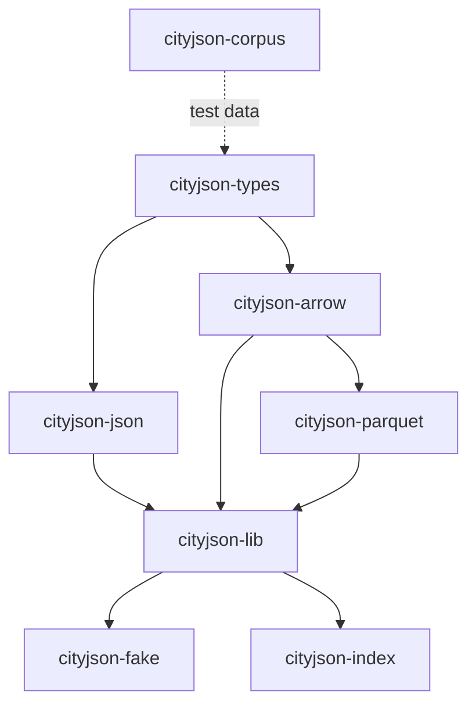

# CityJSON — Rust workspace

[CityJSON](https://www.cityjson.org) is a JSON-based encoding for 3D city
models. This repository is the [3DGI](https://3dgi.nl) Rust workspace
for working with CityJSON data: native parsing, format adapters (JSON,
Arrow, Parquet), a higher-level facade with FFI, synthetic data
generation, and SQLite-backed indexing.

All crates live here as workspace members and release in lockstep under
a single version line.

## Crates

| Crate | Description | crates.io |
|---|---|---|
| [`cityjson-types`](crates/cityjson-types) | Core types and accessors for CityJSON 2.0 | [](https://crates.io/crates/cityjson-types) |
| [`cityjson-json`](crates/cityjson-json) | Serde adapter for CityJSON 2.0 | [](https://crates.io/crates/cityjson-json) |
| [`cityjson-arrow`](crates/cityjson-arrow) | Arrow IPC and Parquet transport | [](https://crates.io/crates/cityjson-arrow) |
| [`cityjson-parquet`](crates/cityjson-parquet) | Parquet read/write via cityjson-arrow | [](https://crates.io/crates/cityjson-parquet) |
| [`cityjson-lib`](crates/cityjson-lib) | Higher-level read/write facade (also on PyPI as `cityjson-lib`) | [](https://crates.io/crates/cityjson-lib) [](https://pypi.org/project/cityjson-lib/) |
| [`cityjson-fake`](crates/cityjson-fake) | Synthetic CityJSON data generator + `cjfake` CLI | [](https://crates.io/crates/cityjson-fake) |
| [`cityjson-index`](crates/cityjson-index) | SQLite-backed index + `cjindex` CLI (also on PyPI as `cityjson-index`) | [](https://crates.io/crates/cityjson-index) [](https://pypi.org/project/cityjson-index/) |

Shared test fixtures and benchmark data live in
[`cityjson-corpus`](https://github.com/3DGI/cityjson-corpus), a separate
repository consumed by this workspace via the
`CITYJSON_SHARED_CORPUS_ROOT` environment variable.

## Dependency graph



## Quick start

```sh
cargo add cityjson-types    # or cityjson-json, cityjson-lib, ...
```

## Python

Two crates also ship Python bindings, published as prebuilt wheels
(Linux x86_64, macOS x86_64 + arm64, Windows AMD64; Python 3.11–3.13):

```sh
pip install cityjson-lib
pip install cityjson-index
```

```python
from cityjson_lib import CityModel

model = CityModel.parse_document_bytes(open("model.city.json", "rb").read())
print(model.summary().cityobject_count)
```

See [`crates/cityjson-lib/ffi/python/README.md`](crates/cityjson-lib/ffi/python/README.md)
and [`crates/cityjson-index/ffi/python/README.md`](crates/cityjson-index/ffi/python/README.md)
for the full Python docs.

## Development

```sh
just check        # cargo check --workspace
just test         # cargo test --workspace
just lint         # strict clippy
just doc          # nightly docsrs build
just ci           # fmt + lint + check + test + doc
```

MSRV: `1.93`. Edition: `2024`. See
[`CONTRIBUTING.md`](CONTRIBUTING.md) for PR guidelines and
[`docs/development.md`](docs/development.md) for the full development
contract.

## Release flow

From a clean `main` checkout:

```sh
cargo release patch --execute   # or minor / major
```

`cargo-release` bumps every crate in lockstep, promotes the `[Unreleased]`
section of `CHANGELOG.md`, commits, tags `v<x.y.z>`, pushes, and
publishes all crates to crates.io. The tag push triggers the GitHub
release workflow.

## License

Dual-licensed under MIT or Apache-2.0, at your option. See
[`LICENSE-MIT`](LICENSE-MIT) and [`LICENSE-APACHE`](LICENSE-APACHE). Each
crate's `Cargo.toml` is the authoritative source if that ever changes.
