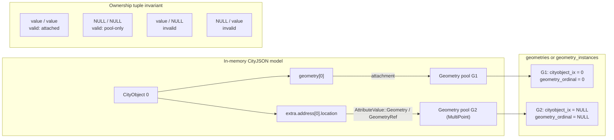

# ADR 002: Preserve Address Location Geometries

Date: 2026-07-24

## Status

Accepted

## Context

CityJSON 2.0 permits each `CityObject.address` entry to contain a `location`.
Unlike the other address members, `location` is not an ordinary JSON attribute:
it is a CityJSON `MultiPoint` geometry object with a type, level of detail, and
boundaries.

The in-memory model stores `address` in the city object's extra attributes.
Geometry-valued attributes are represented by an `AttributeValue::Geometry`
handle into the model geometry pool. The relational projection used by
`cityjson-arrow` names the corresponding attribute node type `GeometryRef`.

Previously, `cityjson-json` parsed the entire address as ordinary attributes.
That lost the geometry semantics of `location`, so it could not become a
resolvable geometry handle. After the JSON representation was corrected,
another gap became visible in the transport layer: Arrow exported only
geometries attached through `CityObject.geometry`. An address location exists
in the geometry pool but is referenced through
`CityObject.extra.address[*].location`, so its projected geometry ID had no
corresponding geometry row. Arrow and Parquet import then failed with a missing
geometry-handle error.

The canonical geometry tables described ownership with two required columns:
`cityobject_ix` and `geometry_ordinal`. Those columns identify an attachment at
`CityObject.geometry[geometry_ordinal]`; they do not identify the geometry
itself. Consequently, a pool geometry referenced only by an attribute has no
truthful values for either column.

## Decision

### CityJSON deserialization and serialization

`cityjson-json` parses `CityObject.address` separately from ordinary extra
attributes while preserving all non-location address members as attribute
values.

For each `address[*].location`, the deserializer:

1. parses the value through the streaming geometry parser;
2. requires its geometry type to be `MultiPoint`;
3. imports it into the model's regular geometry pool; and
4. stores `AttributeValue::Geometry(handle)` at the original address location.

Serialization does not require an address-specific branch. The generic
attribute serializer resolves `AttributeValue::Geometry(handle)` against the
model and delegates to the normal geometry serializer, producing the complete
CityJSON `MultiPoint` object at `address[*].location`.

### Arrow geometry-pool transport

The canonical Arrow schema is cut from
`cityjson-arrow.package.v3alpha3` to
`cityjson-arrow.package.v3alpha4`. This is an intentional alpha-schema hard
cut; no `v3alpha3` compatibility reader is retained.

Arrow export now iterates every occupied entry in the model geometry pool.
Before writing rows, it collects the optional attachment of each geometry from
the city objects:

- an attached geometry writes both `cityobject_ix` and `geometry_ordinal`;
- a geometry referenced only outside `CityObject.geometry` writes both columns
  as null;
- a geometry attached more than once is rejected because one canonical row can
  describe only one attachment.

Both ownership columns are nullable in the boundary-bearing `geometries` table
and in `geometry_instances`. Address locations are currently required to be
`MultiPoint` boundary geometries, but geometry-pool ownership has the same
meaning for every regular geometry kind. Keeping the tables consistent avoids
encoding storage semantics differently by geometry representation.

Projected `GeometryRef` values remain raw geometry IDs. They now resolve
because all occupied geometry-pool entries are transported.

Arrow import adds every geometry row to the pool, then interprets ownership as
one optional tuple:

- `(Some(cityobject_ix), Some(geometry_ordinal))` attaches the geometry to the
  indicated `CityObject.geometry` position;
- `(None, None)` leaves the geometry in the pool for references such as address
  locations;
- either mixed-null state is invalid and rejected.

The two columns must therefore be nullable together. Making only
`cityobject_ix` nullable would leave an ordinal without a geometry list;
making only `geometry_ordinal` nullable would claim an owner without saying
where the geometry is attached. Neither mixed state represents a valid model
relationship.

### Parquet behavior

`cityjson-parquet` uses the shared Arrow canonical schemas, so package and
native-dataset manifests also record `v3alpha4`, and both storage layouts
inherit the nullable ownership tuple.

Spatial fallback bounds are computed from geometries directly attached to a
city object. The fallback therefore skips rows whose `cityobject_ix` is null:
an address location remains available through its attribute handle but must not
be treated as a member of `CityObject.geometry`.

## Consequences

Positive:

- CityJSON address locations deserialize to resolvable geometry handles and
  serialize back to their original geometry representation.
- Arrow streams, Arrow batches, Parquet packages, and native Parquet datasets
  preserve attribute-referenced geometries.
- The geometry tables now distinguish geometry identity from optional city
  object attachment without inventing a false owner.
- Existing projected geometry IDs retain their meaning.

Trade-offs:

- `v3alpha3` Arrow and Parquet data is intentionally incompatible with the
  current reader after the hard schema cut.
- Consumers of the canonical tables must handle nullable ownership columns and
  validate them as a pair.
- A regular geometry can have at most one canonical city object attachment;
  multiply attached handles are rejected during export.
